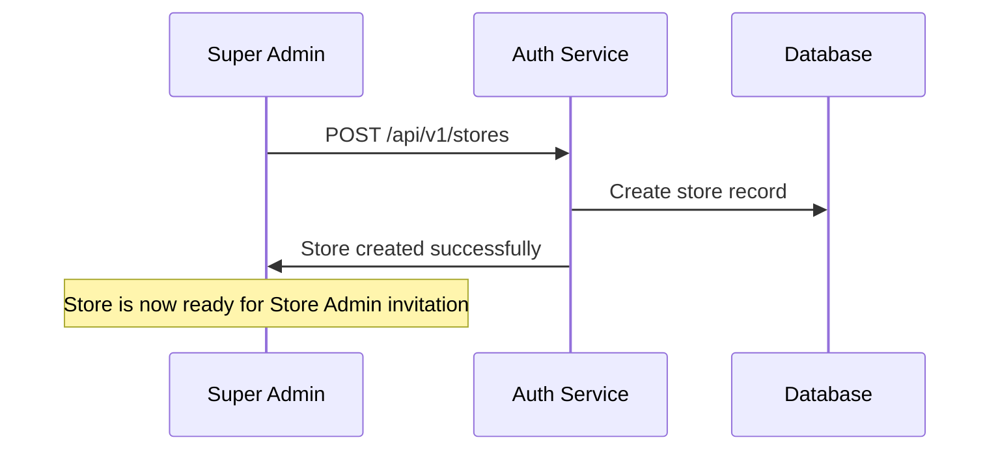
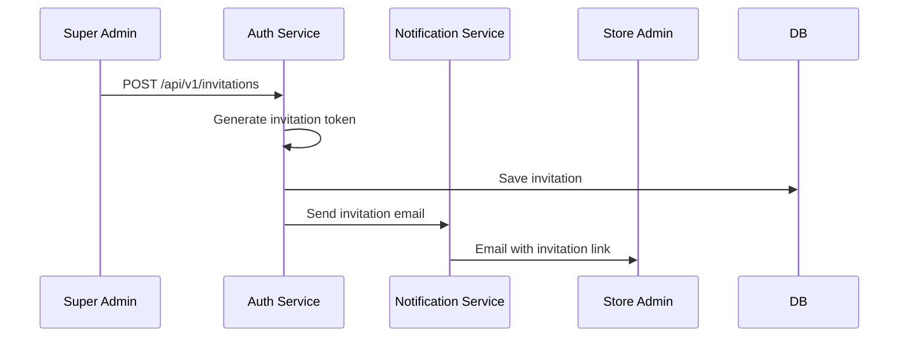
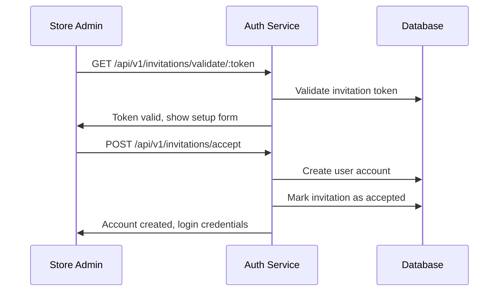
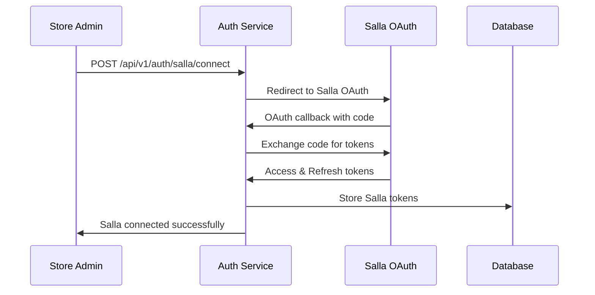

# Dark Horse 3PL Platform - Authentication Flow

---

## Overview

The Dark Horse 3PL Platform implements a **store-centric hierarchical authentication system** with Salla integration. The system ensures secure, controlled access through a chain of authority starting from Super Admin creating stores, then inviting Store Admins who connect their Salla accounts.

### Key Principles
- **Store-Centric Architecture**: All users belong to a specific store
- **No Self-Registration**: Only invitation-based access
- **Salla Integration**: OAuth2 connection for e-commerce functionality
- **Hierarchical Control**: Each role can only invite specific subordinate roles
- **Secure by Default**: JWT-based authentication with refresh tokens

---

## Complete Authentication Flow

### Flow Overview
```
🔴 Super Admin → Creates Store → Invites Store Admin
                      ↓
🟡 Store Admin → Accepts Invite → Connects Salla → Invites Directors
                      ↓
🟠 Directors → Invite Warehouse Managers
                      ↓
🟡 Managers → Invite Workers (Receivers, Pickers, Packers, Shippers)
```

### User Hierarchy & Roles

| Role | Level | Scope | Can Invite | Primary Function |
|------|-------|-------|------------|------------------|
| **Super Admin** | 1 | Global | Store Admins | Platform oversight, store creation |
| **Store Admin** | 2 | Store-wide | Directors | Store operations, Salla integration |
| **Director** | 3 | Multi-warehouse | Managers | Regional operations, warehouse coordination |
| **Manager** | 4 | Single warehouse | Workers | Daily operations, staff management |
| **Workers** | 5 | Task-specific | None | Operational tasks (receive, pick, pack, ship) |

---

## Database Schema

### Core Tables

#### 1. Stores Table
```sql
CREATE TABLE stores (
    id UUID PRIMARY KEY DEFAULT gen_random_uuid(),
    name VARCHAR(255) NOT NULL,
    slug VARCHAR(255) UNIQUE NOT NULL,
    created_by UUID NOT NULL REFERENCES users(id),
    salla_store_id VARCHAR(255),
    salla_access_token TEXT,
    salla_refresh_token TEXT,
    salla_access_token_expire_at TEXT,
    salla_client_id VARCHAR(255),
    salla_client_secret VARCHAR(255),
    salla_connected_at TIMESTAMP,
    is_active BOOLEAN DEFAULT true,
    created_at TIMESTAMP DEFAULT CURRENT_TIMESTAMP,
    updated_at TIMESTAMP DEFAULT CURRENT_TIMESTAMP
);

CREATE INDEX idx_stores_slug ON stores(slug);
CREATE INDEX idx_stores_created_by ON stores(created_by);
```

#### 2. Users Table
```sql
CREATE TYPE user_role AS ENUM (
    'SUPER_ADMIN',
    'STORE_ADMIN', 
    'DIRECTOR',
    'MANAGER',
    'RECEIVER',
    'PICKER',
    'PACKER',
    'SHIPPER'
);

CREATE TABLE users (
    id UUID PRIMARY KEY DEFAULT gen_random_uuid(),
    email VARCHAR(255) UNIQUE NOT NULL,
    password_hash VARCHAR(255),
    first_name VARCHAR(100),
    last_name VARCHAR(100),
    phone VARCHAR(20),
    role user_role NOT NULL,
    store_id UUID REFERENCES stores(id),
    warehouse_id UUID REFERENCES warehouses(id),
    invited_by UUID REFERENCES users(id),
    is_active BOOLEAN DEFAULT true,
    is_email_verified BOOLEAN DEFAULT false,
    last_login_at TIMESTAMP,
    created_at TIMESTAMP DEFAULT CURRENT_TIMESTAMP,
    updated_at TIMESTAMP DEFAULT CURRENT_TIMESTAMP
);

CREATE INDEX idx_users_email ON users(email);
CREATE INDEX idx_users_store_id ON users(store_id);
CREATE INDEX idx_users_role ON users(role);
```

#### 3. Invitations Table
```sql
CREATE TYPE invitation_status AS ENUM (
    'PENDING',
    'ACCEPTED',
    'EXPIRED',
    'CANCELLED'
);

CREATE TABLE invitations (
    id UUID PRIMARY KEY DEFAULT gen_random_uuid(),
    email VARCHAR(255) NOT NULL,
    token VARCHAR(255) UNIQUE NOT NULL,
    role user_role NOT NULL,
    store_id UUID NOT NULL REFERENCES stores(id),
    warehouse_id UUID REFERENCES warehouses(id),
    invited_by UUID NOT NULL REFERENCES users(id),
    permissions JSONB DEFAULT '{}',
    status invitation_status DEFAULT 'PENDING',
    expires_at TIMESTAMP NOT NULL,
    accepted_at TIMESTAMP,
    user_id UUID REFERENCES users(id),
    created_at TIMESTAMP DEFAULT CURRENT_TIMESTAMP,
    updated_at TIMESTAMP DEFAULT CURRENT_TIMESTAMP
);

CREATE INDEX idx_invitations_token ON invitations(token);
CREATE INDEX idx_invitations_email ON invitations(email);
CREATE INDEX idx_invitations_status ON invitations(status);
```

#### 4. User Sessions Table
```sql
CREATE TABLE user_sessions (
    id UUID PRIMARY KEY DEFAULT gen_random_uuid(),
    user_id UUID NOT NULL REFERENCES users(id),
    session_token VARCHAR(255) UNIQUE NOT NULL,
    access_token TEXT NOT NULL,
    refresh_token TEXT NOT NULL,
    ip_address INET,
    user_agent TEXT,
    is_active BOOLEAN DEFAULT true,
    expires_at TIMESTAMP NOT NULL,
    last_activity_at TIMESTAMP DEFAULT CURRENT_TIMESTAMP,
    created_at TIMESTAMP DEFAULT CURRENT_TIMESTAMP
);

CREATE INDEX idx_sessions_user_id ON user_sessions(user_id);
CREATE INDEX idx_sessions_token ON user_sessions(session_token);
CREATE INDEX idx_sessions_active ON user_sessions(is_active, expires_at);
```

#### 5. Warehouses Table
```sql
CREATE TABLE warehouses (
    id UUID PRIMARY KEY DEFAULT gen_random_uuid(),
    name VARCHAR(255) NOT NULL,
    code VARCHAR(50) UNIQUE NOT NULL,
    store_id UUID NOT NULL REFERENCES stores(id),
    address TEXT,
    city VARCHAR(100),
    country VARCHAR(100),
    postal_code VARCHAR(20),
    phone VARCHAR(20),
    manager_id UUID REFERENCES users(id),
    is_active BOOLEAN DEFAULT true,
    created_at TIMESTAMP DEFAULT CURRENT_TIMESTAMP,
    updated_at TIMESTAMP DEFAULT CURRENT_TIMESTAMP
);

CREATE INDEX idx_warehouses_store_id ON warehouses(store_id);
CREATE INDEX idx_warehouses_manager_id ON warehouses(manager_id);
```

#### 6. User Permissions Table
```sql
CREATE TABLE user_permissions (
    id UUID PRIMARY KEY DEFAULT gen_random_uuid(),
    user_id UUID NOT NULL REFERENCES users(id),
    resource VARCHAR(100) NOT NULL,
    action VARCHAR(50) NOT NULL,
    scope VARCHAR(50) DEFAULT 'store', -- 'global', 'store', 'warehouse', 'personal'
    granted_by UUID REFERENCES users(id),
    created_at TIMESTAMP DEFAULT CURRENT_TIMESTAMP,
    UNIQUE(user_id, resource, action)
);

CREATE INDEX idx_permissions_user_id ON user_permissions(user_id);
CREATE INDEX idx_permissions_resource ON user_permissions(resource, action);
```

#### 7. Audit Logs Table
```sql
CREATE TABLE audit_logs (
    id UUID PRIMARY KEY DEFAULT gen_random_uuid(),
    user_id UUID REFERENCES users(id),
    action VARCHAR(100) NOT NULL,
    resource VARCHAR(100),
    resource_id UUID,
    old_values JSONB,
    new_values JSONB,
    ip_address INET,
    user_agent TEXT,
    created_at TIMESTAMP DEFAULT CURRENT_TIMESTAMP
);

CREATE INDEX idx_audit_logs_user_id ON audit_logs(user_id);
CREATE INDEX idx_audit_logs_action ON audit_logs(action);
CREATE INDEX idx_audit_logs_created_at ON audit_logs(created_at);
```

---

## Detailed Authentication Flow

### 1. Super Admin Creates Store



#### API Implementation:
```typescript
export const createStore = asyncHandler(async (req: Request, res: Response) => {
  const { name, slug } = req.body;
  const superAdminId = req.user.id;

  // Validate Super Admin role
  if (req.user.role !== 'SUPER_ADMIN') {
    return res.status(403).json({ error: 'Only Super Admins can create stores' });
  }

  const store = await prisma.store.create({
    data: {
      name,
      slug,
      createdBy: superAdminId,
      isActive: true
    }
  });

  res.status(201).json({
    success: true,
    message: 'Store created successfully',
    data: { store }
  });
});
```

### 2. Super Admin Invites Store Admin



#### API Implementation:
```typescript
export const inviteStoreAdmin = asyncHandler(async (req: Request, res: Response) => {
  const { email, storeId, firstName, lastName } = req.body;
  const inviterId = req.user.id;

  // Validate Super Admin can invite Store Admin
  if (req.user.role !== 'SUPER_ADMIN') {
    return res.status(403).json({ error: 'Only Super Admins can invite Store Admins' });
  }

  // Generate secure invitation token
  const invitationToken = crypto.randomBytes(32).toString('hex');
  const expiresAt = new Date(Date.now() + 72 * 60 * 60 * 1000); // 72 hours

  const invitation = await prisma.invitation.create({
    data: {
      email,
      token: invitationToken,
      role: 'STORE_ADMIN',
      storeId,
      invitedBy: inviterId,
      expiresAt,
      permissions: {
        canInvite: ['DIRECTOR'],
        resources: ['store', 'inventory', 'orders', 'users'],
        actions: ['read', 'write', 'delete']
      }
    }
  });

  // Send invitation email
  await sendInvitationEmail(email, invitationToken, 'STORE_ADMIN', firstName);

  res.status(201).json({
    success: true,
    message: 'Store Admin invitation sent successfully'
  });
});
```

### 3. Store Admin Accepts Invitation



#### API Implementation:
```typescript
export const acceptInvitation = asyncHandler(async (req: Request, res: Response) => {
  const { token, password, firstName, lastName, phone } = req.body;

  // Validate invitation
  const invitation = await prisma.invitation.findFirst({
    where: {
      token,
      status: 'PENDING',
      expiresAt: { gt: new Date() }
    },
    include: { store: true }
  });

  if (!invitation) {
    return res.status(400).json({ error: 'Invalid or expired invitation' });
  }

  // Create user account
  const passwordHash = await bcrypt.hash(password, 12);
  
  const user = await prisma.user.create({
    data: {
      email: invitation.email,
      passwordHash,
      firstName,
      lastName,
      phone,
      role: invitation.role,
      storeId: invitation.storeId,
      warehouseId: invitation.warehouseId,
      invitedBy: invitation.invitedBy,
      isActive: true,
      isEmailVerified: true
    }
  });

  // Mark invitation as accepted
  await prisma.invitation.update({
    where: { id: invitation.id },
    data: { 
      status: 'ACCEPTED',
      acceptedAt: new Date(),
      userId: user.id
    }
  });

  // Generate JWT tokens
  const tokens = generateTokenPair(user);

  res.status(201).json({
    success: true,
    message: 'Account created successfully',
    data: {
      user: sanitizeUser(user),
      tokens,
      store: invitation.store
    }
  });
});
```

### 4. Store Admin Connects Salla Account



#### Current Implementation (Enhanced):
```typescript
export const connectSalla = asyncHandler(async (req: Request, res: Response) => {
  const { clientId, clientSecret } = req.body;
  const userId = req.user.id;
  const storeId = req.user.storeId;

  // Update store with Salla credentials
  await prisma.store.update({
    where: { id: storeId },
    data: {
      sallaClientId: clientId,
      sallaClientSecret: clientSecret
    }
  });

  // Generate OAuth URL
  const state = crypto.randomBytes(16).toString('hex');
  const redirectUri = `${process.env.APP_URL}/api/v1/auth/salla/callback`;
  
  const sallaAuthUrl = `https://accounts.salla.sa/oauth2/auth?client_id=${clientId}&redirect_uri=${redirectUri}&response_type=code&scope=offline_access&state=${state}`;

  // Store state in session for validation
  await redis.setex(`salla_state:${userId}`, 600, state); // 10 minutes

  res.json({
    success: true,
    authUrl: sallaAuthUrl,
    message: 'Please complete Salla authorization'
  });
});

export const sallaCallback = asyncHandler(async (req: Request, res: Response) => {
  const { code, state } = req.query;
  const userId = req.user?.id;

  if (!userId) {
    return res.status(401).json({ error: 'Authentication required' });
  }

  // Validate state
  const storedState = await redis.get(`salla_state:${userId}`);
  if (!storedState || storedState !== state) {
    return res.status(400).json({ error: 'Invalid state parameter' });
  }

  // Get store credentials
  const store = await prisma.store.findFirst({
    where: { id: req.user.storeId }
  });

  if (!store?.sallaClientId || !store?.sallaClientSecret) {
    return res.status(400).json({ error: 'Salla credentials not configured' });
  }

  try {
    // Exchange code for tokens
    const response = await axios.post(
      'https://accounts.salla.sa/oauth2/token',
      new URLSearchParams({
        grant_type: 'authorization_code',
        code: code as string,
        client_id: store.sallaClientId,
        client_secret: store.sallaClientSecret,
        redirect_uri: `${process.env.APP_URL}/api/v1/auth/salla/callback`
      }),
      { headers: { 'Content-Type': 'application/x-www-form-urlencoded' } }
    );

    const { access_token, refresh_token, expires_in } = response.data;

    // Store tokens in database
    await prisma.store.update({
      where: { id: store.id },
      data: {
        sallaAccessToken: access_token,
        sallaRefreshToken: refresh_token,
        sallaConnectedAt: new Date()
      }
    });

    // Clean up state
    await redis.del(`salla_state:${userId}`);

    res.json({
      success: true,
      message: 'Salla account connected successfully',
      data: {
        expires_in,
        connected_at: new Date()
      }
    });

  } catch (error) {
    console.error('Salla OAuth error:', error);
    res.status(500).json({ error: 'Failed to connect Salla account' });
  }
});
```

### 5. Hierarchical User Invitations

#### Store Admin Invites Directors
```typescript
export const inviteDirector = asyncHandler(async (req: Request, res: Response) => {
  const { email, firstName, lastName, permissions } = req.body;
  const inviterId = req.user.id;

  // Validate Store Admin can invite Directors
  if (req.user.role !== 'STORE_ADMIN') {
    return res.status(403).json({ error: 'Only Store Admins can invite Directors' });
  }

  const invitation = await createInvitation({
    email,
    role: 'DIRECTOR',
    storeId: req.user.storeId,
    invitedBy: inviterId,
    permissions: permissions || {
      canInvite: ['MANAGER'],
      resources: ['warehouses', 'inventory', 'orders', 'users'],
      actions: ['read', 'write']
    }
  });

  await sendInvitationEmail(email, invitation.token, 'DIRECTOR', firstName);

  res.status(201).json({
    success: true,
    message: 'Director invitation sent successfully'
  });
});
```

#### Directors Invite Managers
```typescript
export const inviteManager = asyncHandler(async (req: Request, res: Response) => {
  const { email, firstName, lastName, warehouseId } = req.body;
  const inviterId = req.user.id;

  if (req.user.role !== 'DIRECTOR') {
    return res.status(403).json({ error: 'Only Directors can invite Managers' });
  }

  const invitation = await createInvitation({
    email,
    role: 'MANAGER',
    storeId: req.user.storeId,
    warehouseId,
    invitedBy: inviterId,
    permissions: {
      canInvite: ['RECEIVER', 'PICKER', 'PACKER', 'SHIPPER'],
      resources: ['warehouse_operations', 'inventory', 'orders', 'workers'],
      actions: ['read', 'write']
    }
  });

  await sendInvitationEmail(email, invitation.token, 'MANAGER', firstName);

  res.status(201).json({
    success: true,
    message: 'Manager invitation sent successfully'
  });
});
```

#### Managers Invite Workers
```typescript
export const inviteWorker = asyncHandler(async (req: Request, res: Response) => {
  const { email, firstName, lastName, role } = req.body;
  const inviterId = req.user.id;

  if (req.user.role !== 'MANAGER') {
    return res.status(403).json({ error: 'Only Managers can invite Workers' });
  }

  const validWorkerRoles = ['RECEIVER', 'PICKER', 'PACKER', 'SHIPPER'];
  if (!validWorkerRoles.includes(role)) {
    return res.status(400).json({ error: 'Invalid worker role' });
  }

  const invitation = await createInvitation({
    email,
    role,
    storeId: req.user.storeId,
    warehouseId: req.user.warehouseId,
    invitedBy: inviterId,
    permissions: {
      canInvite: [],
      resources: [`${role.toLowerCase()}_tasks`],
      actions: ['read', 'write']
    }
  });

  await sendInvitationEmail(email, invitation.token, role, firstName);

  res.status(201).json({
    success: true,
    message: `${role} invitation sent successfully`
  });
});
```

---

## API Endpoints

### Authentication Endpoints

| Method | Endpoint | Description | Required Role | Body Parameters |
|--------|----------|-------------|---------------|-----------------|
| `POST` | `/api/v1/auth/login` | User login | Public | `email, password` |
| `POST` | `/api/v1/auth/logout` | User logout | Authenticated | - |
| `POST` | `/api/v1/auth/refresh` | Refresh access token | Authenticated | `refreshToken` |
| `GET` | `/api/v1/auth/profile` | Get user profile | Authenticated | - |
| `PUT` | `/api/v1/auth/profile` | Update user profile | Authenticated | `firstName, lastName, phone` |
| `POST` | `/api/v1/auth/change-password` | Change password | Authenticated | `currentPassword, newPassword` |

### Store Management Endpoints

| Method | Endpoint | Description | Required Role | Body Parameters |
|--------|----------|-------------|---------------|-----------------|
| `POST` | `/api/v1/stores` | Create store | Super Admin | `name, slug` |
| `GET` | `/api/v1/stores` | List stores | Super Admin | - |
| `GET` | `/api/v1/stores/:id` | Get store details | Store Admin+ | - |
| `PUT` | `/api/v1/stores/:id` | Update store | Store Admin+ | `name, description` |
| `DELETE` | `/api/v1/stores/:id` | Delete store | Super Admin | - |

### Salla Integration Endpoints

| Method | Endpoint | Description | Required Role | Body Parameters |
|--------|----------|-------------|---------------|-----------------|
| `POST` | `/api/v1/auth/salla/connect` | Connect Salla account | Store Admin | `clientId, clientSecret` |
| `GET` | `/api/v1/auth/salla/callback` | Salla OAuth callback | Public | - |
| `POST` | `/api/v1/auth/salla/disconnect` | Disconnect Salla | Store Admin | - |
| `GET` | `/api/v1/auth/salla/status` | Check Salla connection | Store Admin+ | - |

### Invitation Endpoints

| Method | Endpoint | Description | Required Role | Body Parameters |
|--------|----------|-------------|---------------|-----------------|
| `POST` | `/api/v1/auth/invitations/store-admin` | Invite Store Admin | Super Admin | `email, storeId, firstName, lastName` |
| `POST` | `/api/v1/auth/invitations/director` | Invite Director | Store Admin | `email, firstName, lastName, permissions` |
| `POST` | `/api/v1/auth/invitations/manager` | Invite Manager | Director | `email, firstName, lastName, warehouseId` |
| `POST` | `/api/v1/auth/invitations/worker` | Invite Worker | Manager | `email, firstName, lastName, role` |
| `GET` | `/api/v1/auth/invitations/validate/:token` | Validate invitation | Public | - |
| `POST` | `/api/v1/auth/invitations/accept` | Accept invitation | Public | `token, password, firstName, lastName, phone` |
| `GET` | `/api/v1/auth/invitations` | List invitations | Admin+ | - |
| `DELETE` | `/api/v1/auth/invitations/:id` | Cancel invitation | Admin+ | - |

### User Management Endpoints

| Method | Endpoint | Description | Required Role | Body Parameters |
|--------|----------|-------------|---------------|-----------------|
| `GET` | `/api/v1/users` | List users in scope | Admin+ | - |
| `GET` | `/api/v1/users/:id` | Get user details | Admin+ | - |
| `PUT` | `/api/v1/users/:id` | Update user | Admin+ | `firstName, lastName, phone, isActive` |
| `DELETE` | `/api/v1/users/:id` | Deactivate user | Admin+ | - |
| `POST` | `/api/v1/users/:id/reset-password` | Reset user password | Admin+ | - |

---

## Middleware Implementation

### 1. Authentication Middleware
```typescript
export const authenticate = asyncHandler(async (req: Request, res: Response, next: NextFunction) => {
  const token = req.headers.authorization?.replace('Bearer ', '');
  
  if (!token) {
    return res.status(401).json({ error: 'Access token required' });
  }

  try {
    const decoded = jwt.verify(token, process.env.JWT_SECRET!) as JWTPayload;
    
    // Check if session is active
    const session = await prisma.userSession.findFirst({
      where: {
        sessionToken: decoded.sessionId,
        isActive: true,
        expiresAt: { gt: new Date() }
      },
      include: {
        user: {
          include: {
            store: true,
            warehouse: true
          }
        }
      }
    });

    if (!session || !session.user.isActive) {
      return res.status(401).json({ error: 'Invalid or expired session' });
    }

    // Update last activity
    await prisma.userSession.update({
      where: { id: session.id },
      data: { lastActivityAt: new Date() }
    });

    req.user = session.user;
    next();
  } catch (error) {
    return res.status(401).json({ error: 'Invalid token' });
  }
});
```

### 2. Authorization Middleware
```typescript
export const authorize = (allowedRoles: string[]) => {
  return (req: Request, res: Response, next: NextFunction) => {
    if (!req.user) {
      return res.status(401).json({ error: 'Authentication required' });
    }

    if (!allowedRoles.includes(req.user.role)) {
      return res.status(403).json({ 
        error: 'Insufficient permissions',
        userRole: req.user.role,
        requiredRoles: allowedRoles
      });
    }

    next();
  };
};
```

### 3. Store Scope Middleware
```typescript
export const requireStoreAccess = (req: Request, res: Response, next: NextFunction) => {
  const storeId = req.params.storeId || req.body.storeId;
  
  if (req.user.role === 'SUPER_ADMIN') {
    return next(); // Super admin has access to all stores
  }

  if (!req.user.storeId || req.user.storeId !== storeId) {
    return res.status(403).json({ 
      error: 'Access denied to this store',
      userStoreId: req.user.storeId,
      requestedStoreId: storeId
    });
  }

  next();
};
```

### 4. Salla Connection Middleware
```typescript
export const requireSallaConnection = asyncHandler(async (req: Request, res: Response, next: NextFunction) => {
  const store = await prisma.store.findFirst({
    where: { id: req.user.storeId }
  });

  if (!store?.sallaAccessToken) {
    return res.status(400).json({ 
      error: 'Salla account not connected',
      message: 'Please connect your Salla account first'
    });
  }

  req.store = store;
  next();
});
```

---

## Security Implementation

### 1. JWT Token Management
```typescript
interface JWTPayload {
  sub: string;           // User ID
  email: string;         // User email
  role: string;          // User role
  storeId?: string;      // Store ID
  warehouseId?: string;  // Warehouse ID
  sessionId: string;     // Session tracking
  iat: number;          // Issued at
  exp: number;          // Expires at
}

export const generateTokenPair = (user: User) => {
  const sessionId = crypto.randomUUID();
  
  const accessToken = jwt.sign(
    {
      sub: user.id,
      email: user.email,
      role: user.role,
      storeId: user.storeId,
      warehouseId: user.warehouseId,
      sessionId
    },
    process.env.JWT_SECRET!,
    { expiresIn: '15m' }
  );

  const refreshToken = jwt.sign(
    { sub: user.id, sessionId },
    process.env.JWT_REFRESH_SECRET!,
    { expiresIn: '7d' }
  );

  return { accessToken, refreshToken, sessionId };
};
```

### 2. Permission System
```typescript
interface RolePermissions {
  canInvite: string[];
  resources: string[];
  actions: string[];
  scope: 'global' | 'store' | 'warehouse' | 'personal';
}

const ROLE_PERMISSIONS: Record<string, RolePermissions> = {
  SUPER_ADMIN: {
    canInvite: ['STORE_ADMIN'],
    resources: ['*'],
    actions: ['*'],
    scope: 'global'
  },
  STORE_ADMIN: {
    canInvite: ['DIRECTOR'],
    resources: ['store', 'inventory', 'orders', 'users', 'salla'],
    actions: ['read', 'write', 'delete'],
    scope: 'store'
  },
  DIRECTOR: {
    canInvite: ['MANAGER'],
    resources: ['warehouses', 'inventory', 'orders', 'users'],
    actions: ['read', 'write'],
    scope: 'store'
  },
  MANAGER: {
    canInvite: ['RECEIVER', 'PICKER', 'PACKER', 'SHIPPER'],
    resources: ['warehouse_operations', 'inventory', 'orders', 'workers'],
    actions: ['read', 'write'],
    scope: 'warehouse'
  },
  RECEIVER: {
    canInvite: [],
    resources: ['receiving_tasks', 'inventory'],
    actions: ['read', 'write'],
    scope: 'warehouse'
  },
  PICKER: {
    canInvite: [],
    resources: ['picking_tasks', 'orders'],
    actions: ['read', 'write'],
    scope: 'warehouse'
  },
  PACKER: {
    canInvite: [],
    resources: ['packing_tasks', 'orders'],
    actions: ['read', 'write'],
    scope: 'warehouse'
  },
  SHIPPER: {
    canInvite: [],
    resources: ['shipping_tasks', 'orders'],
    actions: ['read', 'write'],
    scope: 'warehouse'
  }
};
```

### 3. Audit Logging
```typescript
export const logActivity = async (
  userId: string,
  action: string,
  resource?: string,
  resourceId?: string,
  oldValues?: any,
  newValues?: any,
  req?: Request
) => {
  await prisma.auditLog.create({
    data: {
      userId,
      action,
      resource,
      resourceId,
      oldValues,
      newValues,
      ipAddress: req?.ip,
      userAgent: req?.get('User-Agent')
    }
  });
};
```

---

## Error Handling

### Standard Error Responses

#### Authentication Errors
```json
{
  "success": false,
  "error": "AUTHENTICATION_REQUIRED",
  "message": "Access token required",
  "code": 401
}
```

#### Authorization Errors
```json
{
  "success": false,
  "error": "INSUFFICIENT_PERMISSIONS",
  "message": "Only Store Admins can invite Directors",
  "code": 403,
  "details": {
    "userRole": "DIRECTOR",
    "requiredRole": "STORE_ADMIN"
  }
}
```

#### Validation Errors
```json
{
  "success": false,
  "error": "VALIDATION_ERROR",
  "message": "Invalid invitation token",
  "code": 422,
  "details": {
    "field": "token",
    "issue": "expired"
  }
}
```

#### Salla Integration Errors
```json
{
  "success": false,
  "error": "SALLA_CONNECTION_REQUIRED",
  "message": "Please connect your Salla account first",
  "code": 400,
  "details": {
    "storeId": "uuid",
    "sallaConnected": false
  }
}
```

---
